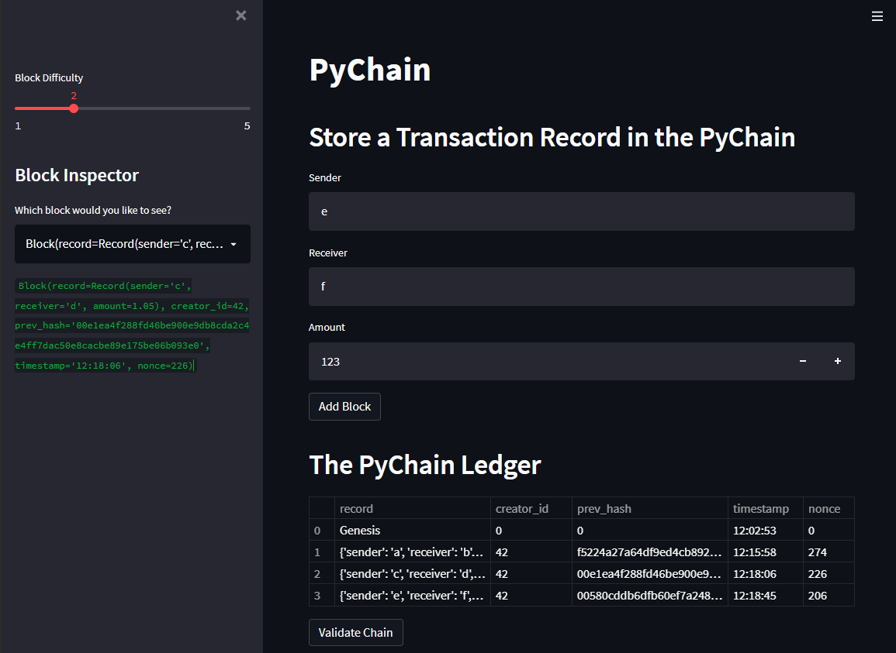
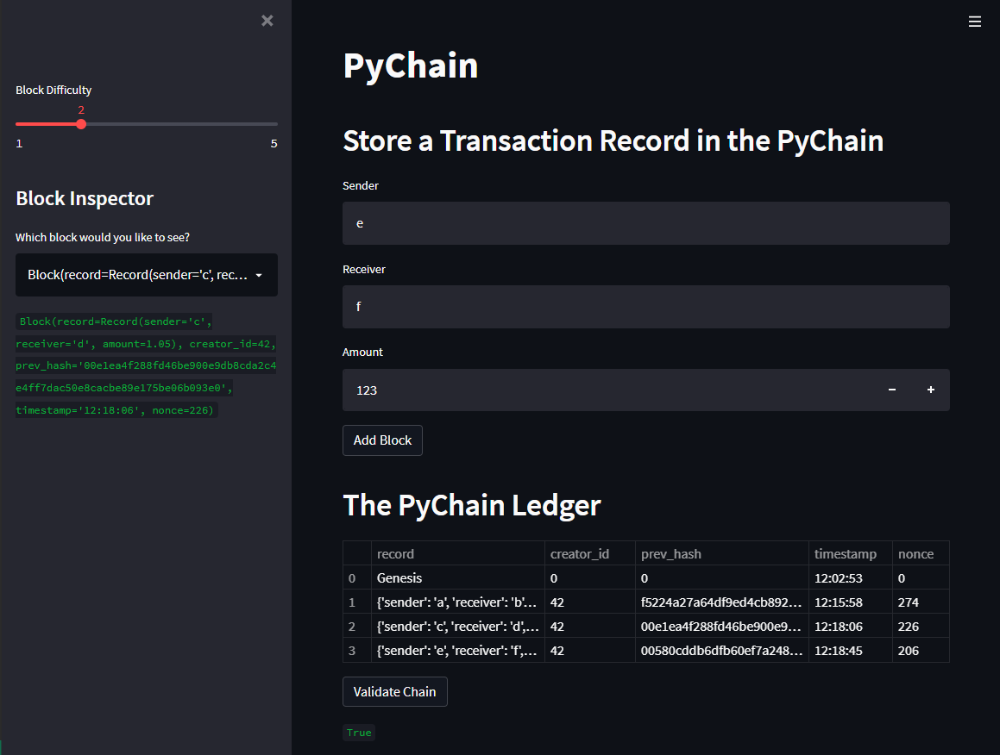

# PyChain Ledger

This app creates a blockchain-based ledger system, complete with a user-friendly web interface.
This ledger records financial transactions (i.e. to transfer money between senders and receivers) and verifies the integrity of the data in the ledger.

## Installation

```bash
# git clone this repo
cd path/to/repo
conda create -n <env-name> python=3.7 -y
conda activate <env-name>
pip install -r requirements.txt
```

## Demo

```bash
cd path/to/repo
bash run.sh
```

## Sample results

### A blockchain consisting of multiple blocks.



### Blockchain validation



